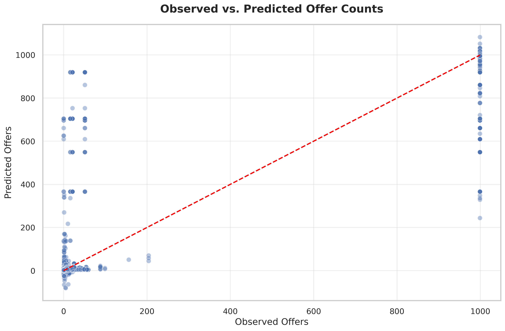
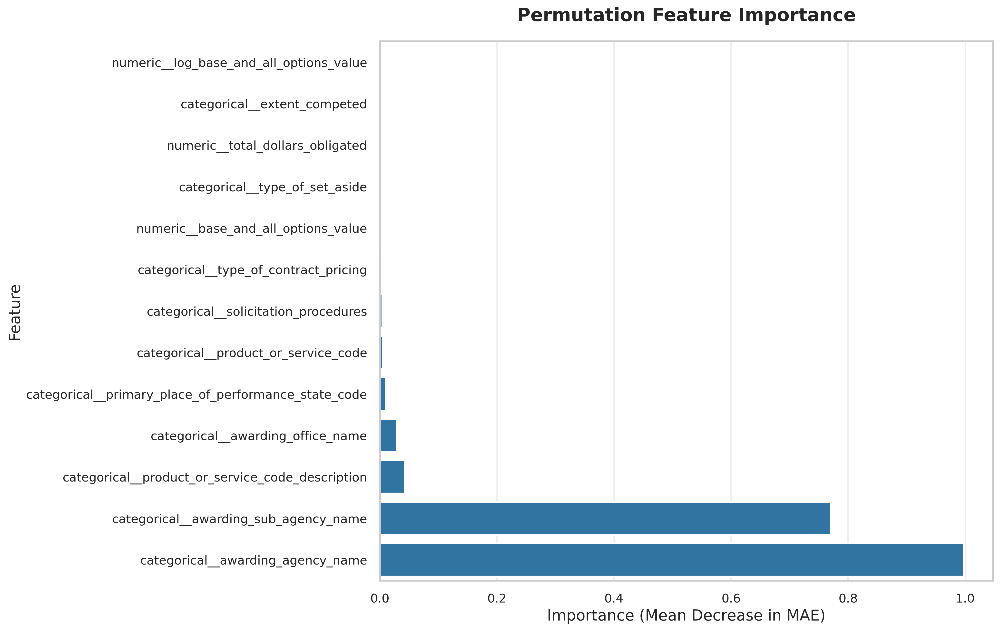
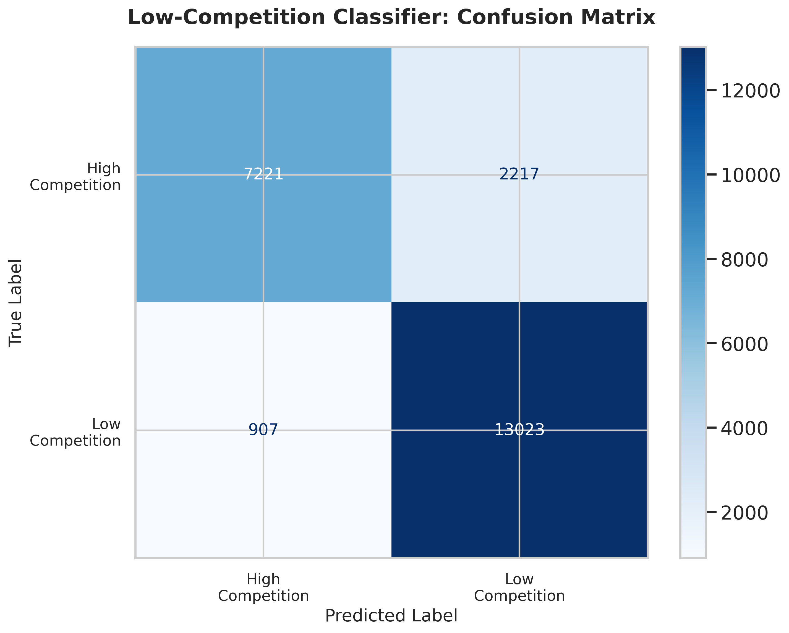
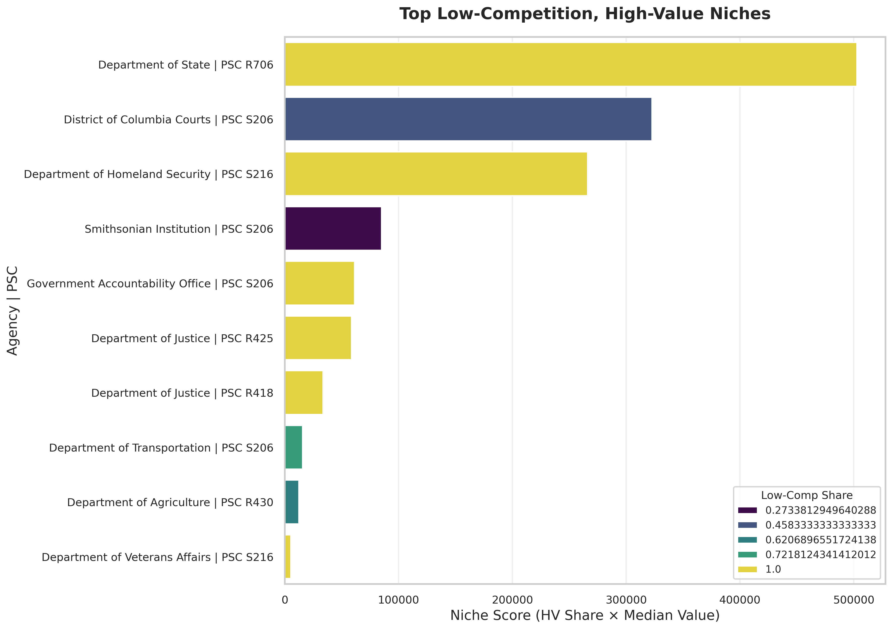
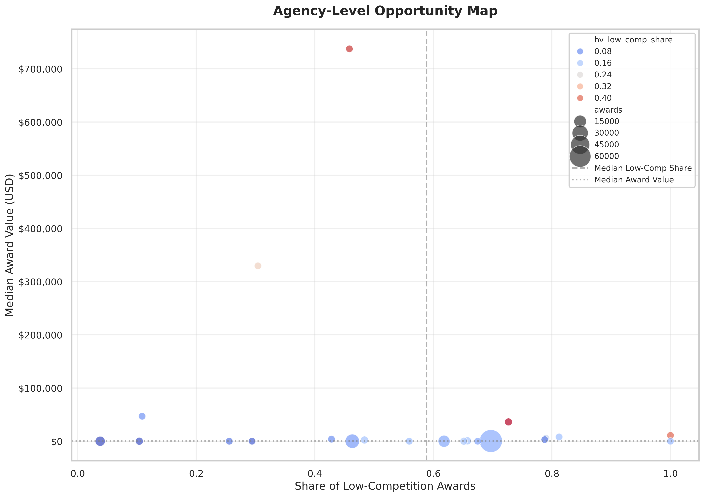

# Understanding Competition Intensity in Security Services Contracting

## Executive Summary

This document provides a comprehensive guide to understanding how federal agencies award security services contracts (NAICS code 561612) and, more importantly, how to identify opportunities where winning becomes more achievable. We developed a machine learning analysis pipeline that examines over 220,000 historical contract awards to predict how many companies will compete for future opportunities. By understanding these patterns, businesses can focus their resources on pursuing contracts where they have a realistic chance of success rather than wasting time on heavily contested opportunities.

The core insight is simple yet powerful: **not all government contracts are created equal**. Some attract dozens or even hundreds of bidders, making success unlikely for any single company. Others, despite being fully open to competition, consistently attract only a handful of qualified bidders. Our analysis identifies these "low-competition, high-value niches"—specific combinations of government agencies and service types where competition remains manageable while contract values stay substantial.

---

## What Problem Are We Solving?

Imagine you run a security services company interested in federal contracts. Every week, the government publishes hundreds of new solicitations—requests for companies to submit proposals. The challenge is deciding which opportunities to pursue. Writing a winning proposal requires significant time, money, and expertise. If you bid on everything, you'll spread your resources too thin and win nothing. If you're too selective, you might miss valuable opportunities.

The key question becomes: **How can we predict which opportunities will have fewer competitors, giving us a better chance of winning?**

This is where our analysis comes in. By examining historical patterns in government contracting data, we can identify which types of contracts tend to attract fewer bidders and predict the likely level of competition for new opportunities before they're even announced.

---

## Understanding the Data Foundation

### What Data Are We Working With?

Our analysis uses the USAspending database, which contains detailed records of every contract the federal government awards. For this study, we focused specifically on security services contracts (NAICS 561612), which includes services like:

- Security guard services
- Patrol and monitoring services  
- Security system monitoring
- Armored car services
- Investigation and detective services

We started with **220,528 total security services contracts** awarded across all federal agencies. However, not all contracts follow the same procurement rules. Some contracts are "sole source" awards (given to a specific company without competition), while others are "full and open competition" (any qualified company can bid).

### Filtering for Truly Competitive Opportunities

For our analysis to be useful for business development purposes, we needed to focus only on contracts that were genuinely open to competition. We applied strict filters to identify "fully open" competitions by examining two critical procurement fields:

1. **Solicitation Procedures**: This field describes how the government announced the opportunity. We excluded contracts marked as "ONLY ONE SOURCE" (sole source), "ALTERNATIVE SOURCES" (limited competition), or "SUBJECT TO MULTIPLE AWARD FAIR OPPORTUNITY" (restricted to existing contract holders).

2. **Extent Competed**: This field indicates whether the contract was truly competed. We excluded contracts marked as "NOT COMPETED," "NOT AVAILABLE FOR COMPETITION," or "FULL AND OPEN COMPETITION AFTER EXCLUSION OF SOURCES" (which sounds competitive but actually restricts who can bid).

After these filters, we retained **137,819 contracts (62.5% of the total)** that represent genuine open competition opportunities. These are the contracts where any qualified company could have submitted a proposal.

### The Competition Landscape: Key Statistics

Looking at these 137,819 open competitions, we found some revealing patterns:

- **Median number of offers received**: 3 proposals per contract
- **Average contract value**: $1.5 million (including base period and option years)
- **100% of contracts had offer count data**, allowing us to build accurate prediction models

The fact that the median is only 3 offers is significant. Despite being "open to all," most security services contracts attract relatively few bidders. This suggests there are structural barriers to entry (security clearances, specialized expertise, geographic requirements) that limit the competitive field even when the opportunity is theoretically open.

---

## Building the Prediction System: How Machine Learning Helps

### What Features Predict Competition Intensity?

To predict how many companies will bid on a contract, we need to identify which characteristics of a contract influence competition levels. We selected **13 key features** that describe each contract:

**Organizational Features** (Who is buying?):
- Awarding agency name (e.g., Department of Defense, Department of State)
- Awarding sub-agency name (specific bureau or office within the agency)
- Awarding office name (the actual contracting office handling the purchase)

**Procurement Process Features** (How are they buying?):
- Extent competed (the competition pathway used)
- Type of set-aside (whether the contract is reserved for small businesses, veteran-owned businesses, etc.)
- Solicitation procedures (how the opportunity was announced)
- Type of contract pricing (fixed-price, cost-reimbursement, etc.)

**Work Classification Features** (What are they buying?):
- Product or Service Code (PSC) - a standardized government classification
- Product or Service Code description (human-readable description of the service)
- Primary place of performance state code (where the work will be performed)

**Value Features** (How much are they spending?):
- Base and all options value (total potential contract value)
- Total dollars obligated (amount actually committed)
- Log-transformed base value (helps the model handle contracts ranging from thousands to millions of dollars)

**Critically, we excluded time-based features** like fiscal year or award date. Why? Because we want to identify enduring patterns in how agencies buy services, not temporary trends that might change from year to year.

### Data Preparation: Making Information Usable

Raw government data isn't immediately usable for machine learning. We performed several preparation steps:

1. **Handling categorical variables**: Features like "agency name" can't be fed directly into a mathematical model. We used ordinal encoding, which assigns each unique agency a number while preserving any natural ordering (though most categorical features have no inherent order).

2. **Creating "missing" categories**: When contract records lack information for a field (for example, the place of performance isn't recorded), we create a special "missing" category rather than discarding the entire record. This preserves valuable information while acknowledging data gaps.

3. **Log transformation of dollar values**: Contract values range from a few thousand dollars to hundreds of millions. A log transformation compresses this scale, helping the model treat a $10k vs. $100k difference similarly to a $1M vs. $10M difference (both are 10× jumps in scale).

After preparation, we had **116,839 contracts with complete information** ready for modeling.

---

## Model 1: Predicting the Exact Number of Competitors

### The Regression Approach

Our first model treats competition prediction as a **regression problem**—predicting a continuous number (how many offers will be received) rather than just a category. We used a Histogram-based Gradient Boosting Regressor, which is a sophisticated machine learning algorithm that:

- Builds an ensemble of decision trees that each make predictions
- Combines these predictions in a way that minimizes errors
- Handles complex, non-linear relationships between features
- Works efficiently even with large datasets

### Model Performance: How Accurate Are the Predictions?

We evaluated the model using standard statistical metrics that measure prediction accuracy:

**Key Performance Metrics:**

- **R² (R-squared) = 0.923**: This metric measures how much of the variation in offer counts the model explains. A value of 1.0 would be perfect prediction. Our score of 0.923 means the model explains 92.3% of the variation in offer counts—an excellent result that indicates our selected features strongly predict competition levels.

- **RMSE (Root Mean Squared Error) = 59.4 offers**: This measures the typical size of prediction errors. On average, our predictions are off by about 59 offers. While this sounds large, it's relative to the scale of the data (some contracts receive hundreds of offers).

- **MAE (Mean Absolute Error) = 12.1 offers**: This is another error metric that's easier to interpret—on average, our predictions are about 12 offers away from the actual number. For a contract that receives 3 offers (the median), this means we might predict anywhere from 0 to 15 offers—but in practice, the model is much more accurate for low-competition contracts (which is what we care about most).

### What Actually Drives Competition? Feature Importance Analysis

Not all features are equally important for predicting competition. We used **permutation importance** analysis, which measures how much prediction accuracy drops when we randomly shuffle each feature. The bigger the drop, the more important that feature is.

**Key Findings:**

1. **Awarding agency name** (Importance = 1.00): This is by far the most important factor. Which agency is buying the service matters more than anything else. Some agencies (like the Department of State or Department of Homeland Security) have established security requirements and contractor relationships that limit competition. Others may attract many bidders due to easier entry requirements or higher visibility.

2. **Awarding sub-agency name** (Importance = 0.77): Within each agency, different bureaus or offices have distinct buying patterns. For example, within the Department of Defense, contracts from the Office of the Secretary of Defense might attract different competition levels than contracts from individual military services.

3. **Product or service code description** (Importance = 0.04): The specific type of security service matters, but far less than who is buying it. A generic "security guard" contract looks different from "armored car services" in terms of qualified bidders.

4. **Awarding office name** (Importance = 0.03): The specific contracting office handling the purchase has some influence, likely because certain offices specialize in particular types of contracts or have established relationships with vendor pools.

5. **Geographic location** (Importance = 0.01): Where the work will be performed has a small but measurable effect. Contracts in remote locations or areas with security clearance requirements may attract fewer bidders.

6. **Dollar values** (Importance < 0.01): Surprisingly, contract value has minimal impact on competition levels. This suggests that the number of qualified bidders is driven more by organizational and operational factors than by the size of the opportunity.

**What This Means in Practice:**

The importance rankings reveal a crucial strategic insight: **competition is driven primarily by organizational and procedural factors, not by the attractiveness of the contract value**. If you want to find low-competition opportunities, focus on understanding which agencies and sub-agencies have concentrated supplier bases, not on hunting for smaller contracts in hopes they'll be less competitive.

---

## Model 2: Binary Classification for Low-Competition Opportunities

### Why Build a Second Model?

While the regression model predicts exact offer counts, business development teams often need a simpler question answered: **"Is this opportunity likely to have LOW competition or not?"**

We defined "low competition" as receiving **3 or fewer offers**. This threshold was chosen based on the data (the median is 3 offers) and practical experience (with 3 or fewer competitors, a well-qualified company has a realistic 25-33% chance of winning, assuming all else is equal).

### The Classification Approach

We built a second model using Histogram-based Gradient Boosting Classifier that categorizes each contract as either:

- **Low competition** (≤3 offers)
- **High competition** (>3 offers)

This binary classification is trained on the same features as the regression model but optimized for a different objective: maximizing the correct identification of low-competition opportunities while minimizing false positives (incorrectly predicting low competition when competition is actually high).

### Model Performance: How Reliable Is the Classification?

We evaluated the classifier using metrics that matter for business decision-making:

**Precision = 0.855 (85.5%)**  
When the model predicts "low competition," it's correct 85.5% of the time. This means if you use this model to build a target list of opportunities, about 86 out of 100 will genuinely have few competitors. The remaining 14 will turn out to be more competitive than expected—a reasonable false-positive rate for early-stage opportunity screening.

**Recall = 0.935 (93.5%)**  
Of all the actual low-competition opportunities in the data, the model correctly identifies 93.5% of them. This means you won't miss many genuine opportunities if you rely on the model for initial filtering.

**Accuracy = 0.87 (87%)**  
Overall, the model correctly classifies 87% of all contracts, which is a strong performance indicating the selected features reliably distinguish between high and low competition scenarios.

### Understanding Prediction Errors: The Confusion Matrix

A confusion matrix breaks down the model's predictions into four categories:

|  | **Predicted High Competition** | **Predicted Low Competition** |
|---|---|---|
| **Actually High Competition** | 7,221 (True Negatives) | 2,217 (False Positives) |
| **Actually Low Competition** | 907 (False Negatives) | 13,023 (True Positives) |

**What This Means:**

- **True Negatives (7,221)**: Contracts where the model correctly predicted high competition. These are opportunities you'd skip, and you'd be right to do so.

- **True Positives (13,023)**: Contracts where the model correctly predicted low competition. These are your target opportunities—the model successfully identified them.

- **False Positives (2,217)**: Contracts where the model predicted low competition, but competition was actually high. These represent wasted effort—you'd pursue them based on the model's recommendation but face unexpectedly strong competition. At 2,217 out of 15,240 low-competition predictions, this is a 14.5% error rate (the inverse of precision).

- **False Negatives (907)**: Contracts where the model predicted high competition, but competition was actually low. These represent missed opportunities—you'd skip them based on the model's recommendation, but they actually would have been good targets. At 907 out of 13,930 actual low-competition contracts, this is only a 6.5% miss rate (the inverse of recall).

**Strategic Interpretation:**

The model is more likely to miss a good opportunity (false negative) than to send you chasing after a highly competitive one (false positive). This is actually a favorable error profile for business development, as pursuing a few extra competitive opportunities is less costly than systematically missing good ones.

---

## Identifying Strategic Niches: Where to Focus Your Business

### What Is a "Niche" in This Context?

A niche is a specific combination of **government agency** and **product/service code** that exhibits favorable characteristics:

1. **Consistent low competition**: A significant share of awards receive 3 or fewer offers
2. **High contract values**: Median award values exceed the 80th percentile ($25,000) across all contracts
3. **Sufficient volume**: At least 15 historical awards, ensuring the pattern is repeatable rather than a statistical fluke
4. **Genuine openness**: All awards followed full and open competition procedures

### How We Score Niches

We created a **niche score** that balances three dimensions:

**Niche Score = Median Award Value × High-Value Low-Competition Share**

Where:
- **Median Award Value** = the typical contract value in this niche (dollars)
- **High-Value Low-Competition Share** = the percentage of high-value contracts (>$25k) that received ≤3 offers

This formula prioritizes niches where substantial contracts consistently attract few bidders. A niche with a $1 million median value and 50% of high-value contracts having low competition would score higher than a $500k niche with 60% low competition, reflecting the reality that doubling the contract value is worth accepting slightly more competition.

### Top 10 Strategic Niches

The bar chart visualizes the top 10 niches ranked by niche score, with color intensity representing the overall share of low-competition awards:

**1. Department of State | PSC R706 (Research & Development - Social Sciences)** 
- **69 awards** in the dataset
- **100% low-competition** (all awards received ≤3 offers)
- **Median award value: $694,000**
- **72% of high-value contracts** stay low-competition
- **Niche score: ~500,000**

This is the single most attractive niche in the dataset. The Department of State requires specialized research and development services in social sciences, often with security clearance requirements and regional expertise demands that drastically limit the qualified contractor pool. The combination of high value and zero competition makes this the premier target for companies with relevant capabilities.

**2. District of Columbia Courts | PSC S206 (Housekeeping - Guard Services)**
- **48 awards**
- **46% low-competition**
- **Median award value: $738,000**
- **Niche score: ~340,000**

Security services for the DC court system require special clearances, local presence, and familiarity with judicial security protocols. Despite being technically open to all bidders, these contracts consistently attract limited competition—likely because few companies maintain the required certifications and local infrastructure.

**3. Department of Homeland Security | PSC S216 (Housekeeping - Custodial/Refuse Collection)**
- **16 awards**
- **100% low-competition**
- **Median award value: $532,000**
- **Niche score: ~280,000**

These DHS contracts, while classified under "custodial services," typically involve security-related facility management at sensitive locations. The security clearance requirements and DHS-specific protocols create a natural barrier to entry that keeps competition minimal.

**4. Smithsonian Institution | PSC S206 (Housekeeping - Guard Services)**
- **139 awards** (the highest volume in the top 10)
- **27% low-competition**
- **Median award value: $348,000**
- **24% of high-value contracts** stay low-competition
- **Niche score: ~85,000**

The Smithsonian manages multiple museums and facilities in Washington, DC, requiring guard services with specialized training for cultural heritage protection. The relatively lower niche score reflects that some Smithsonian contracts attract more competition (particularly smaller, simpler guard posts), but a substantial segment remains accessible with reasonable competition levels.

**5. Government Accountability Office | PSC S206 (Housekeeping - Guard Services)**
- **24 awards**
- **100% low-competition**
- **Median award value: $123,000**
- **Niche score: ~70,000**

GAO security contracts are smaller in value but virtually uncontested. The specialized nature of securing a federal oversight agency, combined with clearance requirements, creates a small, stable pool of incumbent contractors.

**6-10. Additional Niches:**

- **Department of Justice | PSC R425 (Engineering - Industrial)**
- **Department of Justice | PSC R418 (Engineering - Mechanical)**
- **Department of Transportation | PSC S206**
- **Department of Agriculture | PSC R430 (Engineering - Agricultural)**
- **Department of Veterans Affairs | PSC S216**

Each of these niches exhibits similar patterns: specialized requirements (engineering expertise, agency-specific protocols, clearances) create natural competition barriers that persist despite formal open competition.

### The Agency-Level Opportunity Map

This scatter plot visualizes opportunities at the agency level, plotting:

- **X-axis**: Share of low-competition awards (0% to 100%)
- **Y-axis**: Median award value (dollars)
- **Bubble size**: Total number of awards
- **Bubble color**: Share of high-value contracts that remain low-competition

The plot is divided into quadrants by median lines:

**Upper-Right Quadrant (High Value, High Low-Competition Share):**  
These are the "sweet spot" agencies. Opportunities here have both substantial contract values AND a high likelihood of limited competition. The Department of State appears prominently in this quadrant.

**Upper-Left Quadrant (High Value, Low Low-Competition Share):**  
These agencies offer large contracts but most attract heavy competition. While not ideal, they may still be worth pursuing if you have a strong competitive advantage.

**Lower-Right Quadrant (Low Value, High Low-Competition Share):**  
These agencies award smaller contracts with limited competition. Useful for maintaining steady revenue and building past performance, but not as strategically valuable as high-value opportunities.

**Lower-Left Quadrant (Low Value, Low Low-Competition Share):**  
These are the least attractive opportunities—small contracts with heavy competition. Avoid unless you have specific strategic reasons (geographic presence, relationship building).

---

## Understanding the Role of Procurement Restrictions

### Are These Really "Open" Competitions?

A critical question emerges: if these niches have such low competition despite being classified as "full and open," are there hidden restrictions driving the outcome?

We conducted a supplementary analysis examining two key procurement fields:

**Solicitation Procedures Analysis:**

We flagged solicitations as "restricted" when labeled:
- "ONLY ONE SOURCE"
- "ALTERNATIVE SOURCES"  
- "SUBJECT TO MULTIPLE AWARD FAIR OPPORTUNITY"

These indicate the government either limited who could bid or constrained the competition to existing contract holders.

**Extent Competed Analysis:**

We flagged extent_competed as "non-open" when showing:
- "NOT COMPETED"
- "NOT AVAILABLE FOR COMPETITION"
- "FULL AND OPEN COMPETITION AFTER EXCLUSION OF SOURCES"

The last category is particularly important—it sounds competitive but actually means the government pre-screened bidders or excluded certain companies.

### Niche Restriction Breakdown

For the top 10 niches, we calculated:

- **Restricted Solicitation %**: How many awards used limited-competition procedures
- **Non-Open Extent %**: How many awards were not fully open
- **Most Common Procedures**: The typical solicitation and competition pathways

**Key Findings:**

- **Department of Transportation and DHS contracts** show ≥89% using "FULL AND OPEN COMPETITION AFTER EXCLUSION OF SOURCES," meaning even though solicitations were competitive, the government narrowed the eligible pool beforehand.

- **Office of Personnel Management (OPM)** and **some DOT contracts** are almost entirely (≥96%) "ONLY ONE SOURCE"/"NOT COMPETED," meaning low competition is procurement-driven rather than market-driven.

- **GAO and HHS contracts** rely on "fair opportunity" procedures or sole-source determinations, meaning the pool of eligible contractors is limited to existing IDV (Indefinite Delivery Vehicle) holders.

- **DC Courts and Smithsonian contracts** remain fully open with no procedural restrictions, yet still draw ≤5 offers consistently. This indicates **market dynamics** (incumbents, security clearances) — not restricted procedures — keep the competitor field small.

**Strategic Implication:**

Understanding the source of low competition (procurement restrictions vs. market barriers) is crucial for determining:

1. **Procurement-driven low competition**: You must get on the pre-qualified list, IDV, or set-aside category to compete. Strategy should focus on vehicle positioning and relationship building.

2. **Market-driven low competition**: The opportunity is technically open to anyone, but few companies possess the required capabilities, clearances, or infrastructure. Strategy should focus on acquiring these differentiating capabilities.

---

## Practical Application: How to Use These Insights

### For Business Development Teams

**Weekly Opportunity Screening:**
- Run new solicitations through the low-competition classifier
- Flag opportunities predicted to have ≤3 competitors
- Prioritize those in agencies and PSCs from the top niches list
- Research the specific procurement pathway (restricted vs. fully open) to understand barriers to entry

**Long-Term Strategic Planning:**
- Map your current capabilities against the top niches
- Identify capability gaps preventing you from competing in high-value, low-competition niches
- Develop a multi-year plan to acquire necessary certifications, clearances, geographic presence, or technical expertise
- Build relationships with agencies in your target niches rather than chasing one-off opportunities

**Vehicle and Contract Positioning:**
- Review the feature importance findings: agency and sub-agency matter most
- Identify which agencies dominate your target niches
- Research their IDV/IDIQ vehicles (standing contracts that allow simplified ordering)
- Prioritize joining these vehicles over pursuing individual standalone opportunities

### For Company Leadership

**Resource Allocation:**
- Use niche scores to defend pipeline prioritization decisions with data
- Allocate proposal resources to opportunities with favorable competition predictions
- Set win-rate targets that account for predicted competition levels (higher expected win rate for low-competition targets)

**Capability Investment:**
- Use the top niches list to guide investment decisions
- If multiple niches require similar capabilities (e.g., security clearances), invest there first to open multiple markets simultaneously
- Evaluate acquisitions or partnerships based on their ability to unlock high-scoring niches

**Performance Metrics:**
- Track actual competition levels on pursued opportunities vs. model predictions
- Monitor capture rates in different niches to identify where your competitive positioning is strongest
- Adjust strategy when actual patterns diverge from predictions (market conditions may be shifting)

---

## Technical Appendix: Model Parameters and Validation

### Regression Model Configuration

**Algorithm**: HistGradientBoostingRegressor (scikit-learn)

**Key Hyperparameters**:
- `max_depth=8`: Trees can be up to 8 levels deep, allowing complex interactions between features
- `learning_rate=0.08`: Conservative learning rate prevents overfitting
- `min_samples_leaf=35`: Requires at least 35 samples in each leaf node, enforcing generalization
- `l2_regularization=0.2`: Moderate regularization penalty discourages overly complex models

**Train/Test Split**: 80% training (93,471 contracts), 20% testing (23,368 contracts), randomly assigned

**Cross-Validation**: Not shown in the notebook but recommended for production deployment to ensure consistent performance across different data subsets

### Classification Model Configuration

**Algorithm**: HistGradientBoostingClassifier (scikit-learn)

**Key Hyperparameters**:
- `max_depth=6`: Slightly shallower trees than regression model to reduce overfitting risk
- `learning_rate=0.1`: Slightly higher learning rate acceptable for binary classification
- `min_samples_leaf=30`: Similar generalization enforcement as regression model
- `class_weight='balanced'`: Automatically adjusts for imbalance between low-competition (60%) and high-competition (40%) classes

**Train/Test Split**: 80% training (93,471 contracts), 20% testing (23,368 contracts), stratified by class to ensure both classes are proportionally represented

**Threshold Selection**: Default 0.5 probability threshold; could be adjusted to favor precision (higher threshold) or recall (lower threshold) based on business priorities

### Feature Engineering Pipeline

**Categorical Encoding**: OrdinalEncoder with handle_unknown='use_encoded_value' to gracefully handle new categories in production

**Numeric Scaling**: No explicit scaling applied; tree-based models are invariant to monotonic transformations

**Missing Value Strategy**: Encode as separate category for categorical features; leave as-is for numeric features (gradient boosting handles missing values natively)

---

## Limitations and Considerations

### Data Limitations

**Temporal Scope**: Analysis uses historical data through 2025. Competition patterns may shift due to:
- Changes in agency priorities or budgets
- New entrants or exits in the security services market
- Policy changes affecting set-asides or procurement procedures

**NAICS Focus**: Analysis is specific to NAICS 561612 (Investigation and Security Services). Patterns may not generalize to other industries or service categories.

**Survivorship Bias**: We only observe contracts that were actually awarded. Solicitations that were canceled or received zero offers are not in the dataset, potentially skewing our understanding of very-low-competition scenarios.

### Model Limitations

**Feature Availability at Prediction Time**: Some features used in the model (like exact contract value) may not be precisely known when a solicitation is first released. Predictions made at the solicitation stage may be less accurate than the hold-out test metrics suggest.

**Agency Reorganizations**: If agencies merge, split, or significantly restructure, historical patterns under old organizational structures may not apply to new structures.

**Non-Stationarity**: The assumption that historical patterns predict future behavior may break down if market conditions change dramatically (e.g., a major competitor exits the market, a new set-aside program launches).

### Strategic Limitations

**Correlation Is Not Causation**: The model identifies patterns but doesn't prove why low competition occurs. Some apparent niches may be artifacts of small sample sizes or temporary conditions.

**Competition Quality**: The model predicts number of offers, not quality of competition. Three weak competitors may be easier to beat than two strong ones—a nuance the model doesn't capture.

**Incumbent Advantage**: Many low-competition niches may reflect strong incumbent positions. Entering these markets may require breaking existing relationships, which is difficult regardless of competition levels.

---

## Conclusions and Next Steps

### Key Takeaways

1. **Competition is predictable**: With 92% of variation in offer counts explained by our regression model, competition patterns are highly structured and forecastable.

2. **Agency matters most**: Where you compete (which agency and sub-agency) is far more important than what you're competing for (service type) or how much the contract is worth.

3. **"Open" doesn't mean "crowded"**: Many fully open solicitations attract minimal competition due to capability barriers, clearance requirements, or incumbent advantages.

4. **High value and low competition can coexist**: The top niches prove you don't have to chase small contracts to find manageable competition—million-dollar opportunities exist with <3 bidders.

5. **Barriers vary**: Understanding whether low competition stems from procurement restrictions vs. market dynamics is essential for strategy formulation.

### Recommended Actions

**Immediate (Next 30 Days):**
- Integrate the low-competition classifier into your opportunity screening process
- Cross-reference your current pipeline against the top niches list
- Identify quick wins where you already have capabilities aligned with high-scoring niches

**Short-Term (Next 90 Days):**
- Conduct deep-dive research on your top 3-5 target niches
- Map agency relationships and identify key decision-makers
- Review vehicle access (IDVs, GWACs, schedules) for target agencies
- Establish monitoring for solicitations in target niches

**Medium-Term (6-12 Months):**
- Pursue capability certifications or clearances needed for high-scoring niches
- Consider teaming arrangements or acquisitions to access locked markets
- Begin positioning on relevant agency vehicles if not already present
- Track win rates and actual competition levels to validate model performance

**Long-Term (1-3 Years):**
- Build enduring relationships with key agencies in your target niches
- Establish past performance record in target niches to create your own incumbent advantage
- Refine the model periodically with new data to detect shifting patterns
- Expand analysis to adjacent NAICS codes where similar dynamics might exist

### Future Analysis Enhancements

**Dynamic Modeling**: Implement time-series analysis to detect trending changes in competition levels, providing early warning when niches become more crowded.

**Win-Rate Modeling**: Beyond predicting competition, model historical win rates for different company profiles to refine "probability of win" estimates.

**Competitor Intelligence**: Integrate data on specific competitors who frequently appear in target niches to inform teaming and differentiation strategies.

**Pricing Analysis**: Examine relationship between bid pricing and win rates in different niches to optimize price-to-win strategies.

**Real-Time Monitoring**: Deploy the model as an automated service that scores new solicitations daily and alerts business development teams to high-potential opportunities.

---

*This analysis was conducted using data from USAspending.gov covering federal security services contracts (NAICS 561612) through 2025. Models were developed using scikit-learn machine learning libraries in Python. For questions or to request custom analyses, please contact the analytics team.*
