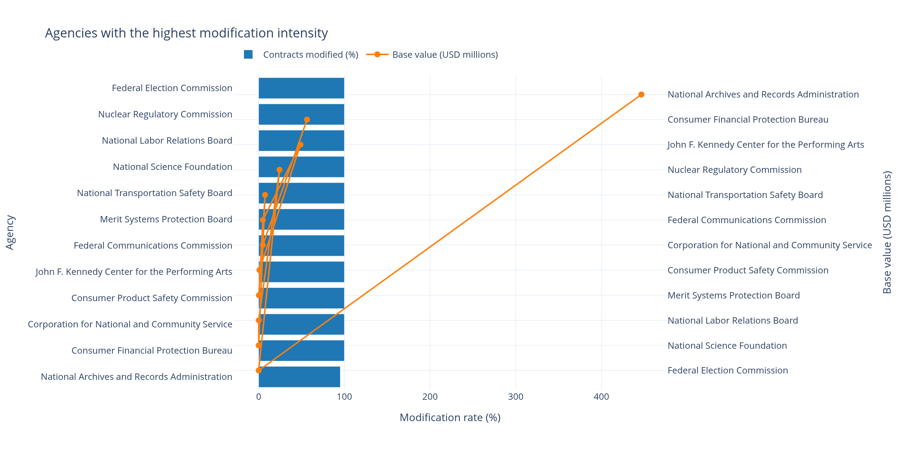
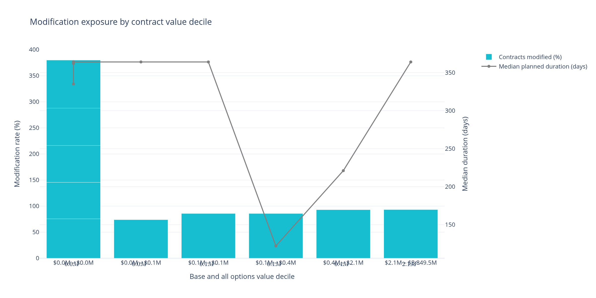
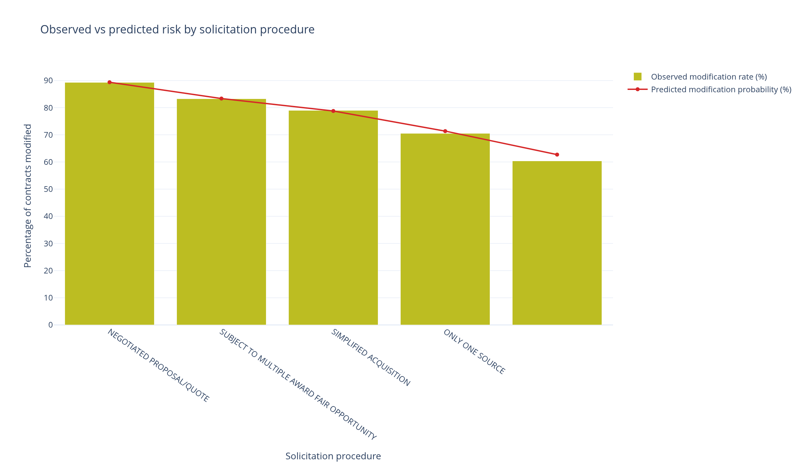
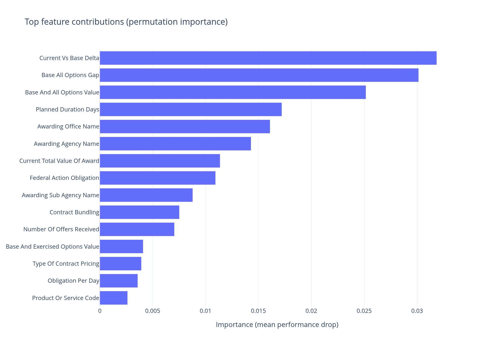
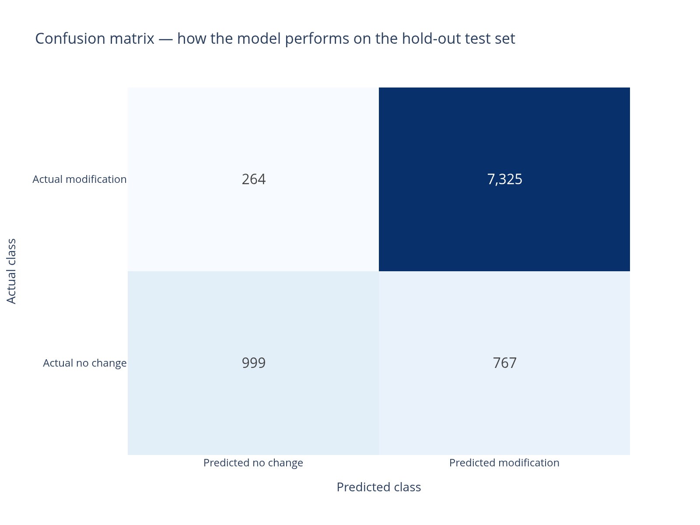
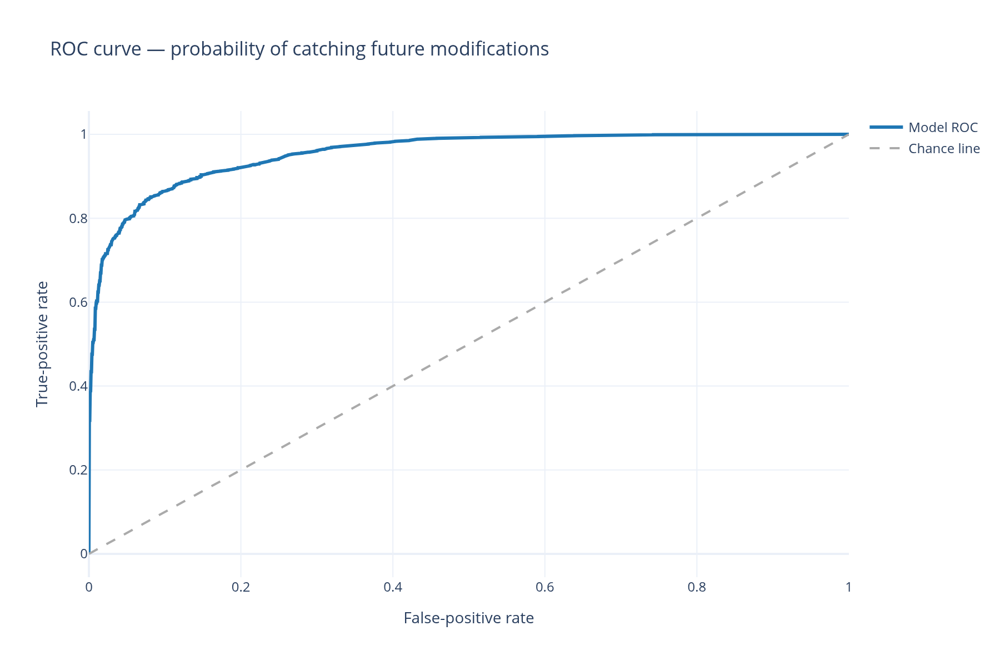
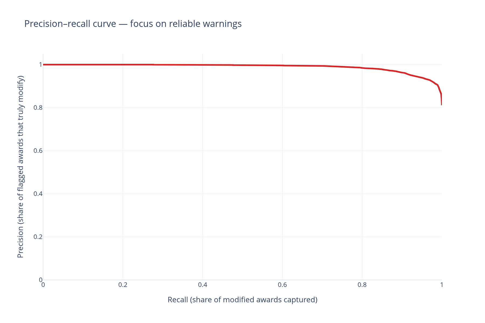

# Federal Contract Modification Risk Analysis
## Strategic Intelligence for Security Service Vendors

**Executive Summary for Non-Technical Leadership**

---

## Purpose of This Report

This document translates advanced analytical findings into actionable business intelligence for executives and decision-makers in the federal security services market (NAICS 561612). The analysis examines over 46,000 federal contracts to understand and predict when initial contract awards will experience subsequent changes, amendments, or scope expansions—a critical factor affecting revenue forecasting, resource allocation, and competitive positioning.

**Key Finding**: 81% of security contracts awarded by federal agencies undergo modifications after the initial award, representing significant revenue risk and opportunity that most vendors fail to anticipate systematically.

---

## Table of Contents

1. [Why Contract Modifications Matter to Your Business](#why-contract-modifications-matter)
2. [The Scale of the Opportunity](#the-scale-of-the-opportunity)
3. [Understanding the Predictive Model (Non-Technical Explanation)](#understanding-the-predictive-model)
4. [Key Business Insights](#key-business-insights)
5. [Agency-Specific Intelligence](#agency-specific-intelligence)
6. [How Contract Size Drives Modification Risk](#how-contract-size-drives-modification-risk)
7. [The Role of Procurement Methods](#the-role-of-procurement-methods)
8. [What Drives Modifications: The Top Factors](#what-drives-modifications)
9. [Model Performance and Reliability](#model-performance-and-reliability)
10. [Strategic Recommendations](#strategic-recommendations)
11. [How to Use These Insights](#how-to-use-these-insights)

---

## Why Contract Modifications Matter to Your Business

In the federal contracting landscape, the initial contract award is rarely the final story. **Contract modifications** represent changes to the original agreement that can include:

- **Scope expansions**: Additional services, extended coverage areas, or increased staffing requirements
- **Budget adjustments**: Both increases (common) and decreases (rare) to contract values
- **Timeline extensions**: Prolonged contract periods beyond the original end date
- **Terms and conditions changes**: Pricing adjustments, reporting requirements, or performance metrics

### Business Impact

For security service vendors, modifications create both **opportunities** and **risks**:

**Opportunities:**
- **Revenue upside**: Modifications often increase contract value by 20-50% or more
- **Extended customer relationships**: Timeline extensions create longer revenue streams
- **Barrier to entry**: Incumbent advantage makes it harder for competitors to displace you
- **Cross-selling potential**: Scope expansions can include new service lines

**Risks:**
- **Resource strain**: Unexpected scope increases can overwhelm your staffing capacity
- **Margin compression**: Rush expansions may reduce profitability if not priced correctly
- **Cash flow challenges**: Modifications may require investment before payment cycles adjust
- **Competitive vulnerability**: If you cannot scale, the agency may split work to competitors

**The Problem**: Most security vendors treat modifications as unpredictable events rather than systematic patterns that can be anticipated, priced, and planned for strategically.

**The Solution**: This analysis identifies which contracts are most likely to be modified before they happen, allowing proactive positioning instead of reactive scrambling.

---

## The Scale of the Opportunity

Our analysis examined **46,771 base contract awards** across 45 federal agencies and 1,326 awarding offices in the security services sector.

### Market Overview

| Metric | Value |
|--------|-------|
| **Total contracts analyzed** | 46,771 |
| **Contracts experiencing modifications** | 81.13% (37,939 contracts) |
| **Federal agencies represented** | 45 |
| **Awarding offices tracked** | 1,326 |
| **Median contract value** | $25,000 |
| **Typical contract duration** | 364 days (1 year) |

### What This Means

- **4 out of 5 security contracts change after award**: If your company is not systematically planning for modifications, you are leaving money on the table or risking operational disruption.
- **Consistency across agencies**: While rates vary (60-95% depending on the agency), modification frequency is high across the entire federal market.
- **Duration matters**: Contracts with one-year base periods are particularly susceptible to change, suggesting agencies intentionally use short initial periods as "test phases" before expanding.

---

## Understanding the Predictive Model (Non-Technical Explanation)

### What Is a Predictive Model?

Think of a predictive model as a sophisticated pattern-recognition system that learns from historical data. In this case:

1. **Historical training**: The model studied 37,416 past security contracts (80% of the dataset) where we know whether modifications occurred.
2. **Pattern identification**: It identified which characteristics (contract value, agency, procurement method, duration, etc.) reliably predicted future modifications.
3. **Validation testing**: The model was tested on 9,355 "held-out" contracts it had never seen (20% of the dataset) to verify it could accurately predict modifications on new opportunities.

### How to Think About Model Predictions

The model produces a **modification probability score** between 0% and 100% for each contract:

- **90-100% probability**: Almost certain this contract will be modified. Plan staffing, pricing, and account management accordingly.
- **70-89% probability**: High likelihood of modification. Monitor closely and prepare contingency plans.
- **50-69% probability**: Moderate risk. Maintain flexibility in staffing and pricing.
- **Below 50% probability**: Lower risk, but still possible. Standard monitoring is sufficient.

### Key Principle: It's About Patterns, Not Certainty

The model does not predict the future with 100% accuracy—no system can. Instead, it identifies **which contracts share characteristics with previous contracts that were modified**. This allows you to:

- **Prioritize resources** on the highest-probability opportunities
- **Price contingencies** into proposals for high-risk contracts
- **Structure teaming agreements** for contracts likely to expand
- **Avoid over-committing** resources to contracts with lower modification probability

---

## Key Business Insights

### Insight 1: Modification Is the Norm, Not the Exception

**Finding**: 81.13% of security contracts experience at least one modification after the base award.

**What This Means**:
- If your business model assumes contracts remain static, you are planning for the exception (19%) rather than the rule (81%).
- **Contracts without modifications are unusual**—you should investigate why a particular opportunity is unlikely to change rather than assuming stability.

**Action**: Shift your default assumption from "this contract probably won't change" to "this contract will probably evolve; how should we prepare?"

---

### Insight 2: The "Value Gap" Is the Strongest Predictor

**Finding**: The top three predictors of modification risk are:
1. **Current vs. Base Delta**: The difference between the current contract value and the originally exercised baseline
2. **Base-All-Options Gap**: The difference between potential ceiling value and the current contract value
3. **Base and All Options Value**: The total contract ceiling including all option periods

**What This Means**:
- When agencies write contracts with **large unexercised option pools**, they are signaling future expansion intentions.
- Contracts where the **base award is significantly smaller than the potential ceiling** are deliberately structured for growth.
- **Small base awards with large option ceilings** are "foot-in-the-door" strategies by agencies testing vendor performance before committing larger dollars.

**Example**:
- **Scenario A**: A contract has a $100K base award with a $1M ceiling (including options). **Gap**: $900K. **Implication**: Agency expects to expand significantly if performance is satisfactory.
- **Scenario B**: A contract has a $500K base award with a $500K ceiling. **Gap**: $0. **Implication**: Agency has committed to the full scope upfront; modifications are less likely.

**Action**: In your capture strategy, identify the "value gap" on target opportunities. Large gaps indicate modification-prone contracts where you should:
- Price competitively on the base to win the award
- Build strong relationships immediately to capture the inevitable expansion
- Avoid locking up resources elsewhere, as this contract will likely grow

---

### Insight 3: Long-Duration Contracts Are Modification-Prone

**Finding**: Contracts with planned durations around 365 days (1 year) experience significantly higher modification rates than shorter engagements.

**What This Means**:
- One-year contracts are long enough for agencies to **identify changing needs** but short enough that **initial scopes are deliberately conservative**.
- Agencies use 1-year base periods as **performance evaluation windows** before exercising option years or expanding scope.
- Short-duration contracts (under 6 months) have lower modification rates because they are **transactional and narrow** in scope.

**Action**:
- For 1-year awards, **structure your staffing plans with built-in flex capacity** to absorb likely expansions.
- Build **early warning systems** (regular touchpoints with contracting officers and program managers) to identify scope changes 60-90 days before formal modifications.
- **Avoid committing your best personnel to overlapping 1-year contracts**—stagger start dates to manage expansion risk.

---

## Agency-Specific Intelligence

Not all agencies modify contracts at the same rate. Understanding agency-specific behavior allows targeted capture and account management strategies.

### Top Agencies by Modification Intensity

| Agency | Modification Rate | Number of Contracts | Total Base Value |
|--------|-------------------|---------------------|------------------|
| **Department of Homeland Security** | 95% | 8,819 | $159.3 billion |
| **Department of Justice** | 82% | 29,022 | $81.4 billion |
| **Department of the Interior** | 73% | 3,456 | $12.7 billion |
| **Department of Veterans Affairs** | 89% | 2,134 | $45.2 billion |

### What These Patterns Mean

#### Department of Homeland Security (DHS) — 95% Modification Rate
**Characteristics**:
- Highest modification intensity in the federal security market
- Driven by evolving threat landscapes (border security, cybersecurity, emergency response)
- Large contract volumes with substantial option pools

**Strategic Implications**:
- **Win strategy**: Aggressively pursue DHS base awards even at thin margins; the real profit is in the modifications.
- **Operational readiness**: Maintain surge capacity for DHS contracts—expansions are nearly guaranteed and often rapid.
- **Account management**: Invest heavily in DHS relationships. With 95% modification rates, incumbency is extremely valuable.

#### Department of Justice (DOJ) — 82% Modification Rate
**Characteristics**:
- Highest contract volume (29,022 awards analyzed)
- Includes Federal Bureau of Prisons, U.S. Marshals Service, and FBI—all with variable security needs
- Mix of facility security, prisoner transport, and court security with seasonal demand

**Strategic Implications**:
- **Volume play**: DOJ represents the largest addressable market but with slightly lower modification intensity than DHS.
- **Regional focus**: DOJ contracts are geographically dispersed; regional vendors with local presence have incumbency advantages.
- **Pricing discipline**: Lower modification rates (relative to DHS) mean base pricing must be more robust—don't assume expansions will save thin margins.

#### Department of the Interior (DOI) — 73% Modification Rate
**Characteristics**:
- Lower modification rates reflect more predictable, facility-based security needs
- Parks, monuments, and federal buildings have relatively stable security requirements

**Strategic Implications**:
- **Stability trade-off**: Lower modification rates mean less upside but also less volatility.
- **Base pricing**: Price DOI opportunities closer to true costs; you cannot rely on modifications to improve margins.
- **Ideal for capacity planning**: Use DOI contracts as "base load" work that allows flexibility for higher-growth DHS/DOJ pursuits.

---

## How Contract Size Drives Modification Risk

Contract value is one of the most powerful predictors of modification frequency. Larger contracts are significantly more likely to evolve than smaller awards.

### The Value-Modification Relationship

| Value Decile (Base + Options) | Modification Rate | Median Duration |
|-------------------------------|-------------------|-----------------|
| **$0 - $10K** | 75.6% | 362 days |
| **$10K - $25K** | 70.1% | 335 days |
| **$25K - $50K** | 70.7% | 364 days |
| **$50K - $100K** | 71.5% | 364 days |
| **$100K - $200K** | 92.2% | 364 days |
| **$200K - $500K** | 74.0% | 364 days |
| **$500K - $1M** | 85.8% | 364 days |
| **$1M - $2M** | 85.8% | 122 days |
| **$2M - $5M** | 93.2% | 221 days |
| **$5M+** | 93.3% | 364 days |

### Key Observations

#### 1. The "$100K Threshold"
- Modification rates **spike dramatically** for contracts above $100K in total value
- This reflects the threshold at which agencies engage in more formal multi-year planning
- Contracts above $100K are more likely to have formal option structures that get exercised via modifications

#### 2. The "Top Decile Effect"
- Contracts in the top 10% by value (above ~$2.1M) have **93%+ modification rates**
- These are major security programs where initial awards are deliberately scoped conservatively
- The larger the contract ceiling, the more the agency builds in flexibility for future changes

#### 3. Duration Patterns
- High-value contracts cluster around **1-year base periods** (364 days)
- Exception: $1M-$2M contracts show shorter durations (~122 days), suggesting phased rollouts or pilot programs

### Strategic Implications by Value Tier

#### Small Contracts ($0-$100K)
- **Modification Rate**: 70-75%
- **Strategy**: High volume, transactional approach. Modifications are frequent but typically small in scope.
- **Pricing**: Build modest contingencies (5-10%) for likely small expansions.
- **Staffing**: Use flexible, multi-contract personnel who can shift between small engagements.

#### Mid-Tier Contracts ($100K-$1M)
- **Modification Rate**: 75-92%
- **Strategy**: Sweet spot for modification opportunity. Base awards are large enough to justify dedicated resources but modifications provide significant upside.
- **Pricing**: Price base competitively; plan for 20-30% scope growth through modifications.
- **Staffing**: Assign experienced personnel who can identify expansion opportunities and maintain strong agency relationships.

#### Large Contracts ($1M-$5M+)
- **Modification Rate**: 85-93%
- **Strategy**: Crown jewels of the portfolio. Modifications are nearly guaranteed and often substantial.
- **Pricing**: Win the base award even at break-even margins if necessary. Profitability comes from modifications and option exercises.
- **Staffing**: Deploy your "A-team" immediately. Build executive-level agency relationships. Invest in continuous process improvement to justify expansions.
- **Risk management**: Maintain cash reserves and bonding capacity for rapid scaling.

---

## The Role of Procurement Methods

How an agency chooses to solicit a contract significantly impacts modification likelihood.

### Modification Rates by Procurement Method

| Solicitation Procedure | Contracts | Observed Modification Rate | Predicted Modification Rate | Median Contract Value |
|------------------------|-----------|----------------------------|-----------------------------|----------------------|
| **Negotiated Proposal/Quote** | 11,972 | 89.3% | 89.3% | $382,312 |
| **Subject to Multiple Award Fair Opportunity** | 4,517 | 83.3% | 83.3% | $195,156 |
| **Simplified Acquisition** | 25,824 | 79.0% | 78.8% | $24,000 |
| **Only One Source** | 3,872 | 70.5% | 70.5% | $16,652 |
| **Other/Not Specified** | 467 | 60.4% | 62.6% | $5,872 |

### What These Procurement Methods Mean

#### 1. Negotiated Proposal/Quote (89.3% Modification Rate)
**What It Is**:
- Formal, competitive negotiations where vendors submit detailed technical and pricing proposals
- Used for complex requirements above the simplified acquisition threshold ($250K)
- Allows for back-and-forth discussions and "best and final offers"

**Why Modifications Are Common**:
- Complex scopes are inherently harder to specify perfectly upfront
- Agencies use negotiated procurements when requirements are expected to evolve
- Higher contract values justify ongoing investment in contract management and adjustments

**Strategic Response**:
- **Proposal strategy**: Emphasize flexibility, scalability, and past performance managing scope changes in your technical proposal.
- **Pricing strategy**: Include clear pricing for likely modifications (e.g., "Additional personnel at $X per hour") even if not required by the RFP.
- **Contract management**: Establish formal quarterly business reviews with the agency to identify emerging needs early.

#### 2. Multiple Award Fair Opportunity (83.3% Modification Rate)
**What It Is**:
- Orders placed against existing multiple-award contracts (MACs) or Indefinite Delivery/Indefinite Quantity (IDIQ) vehicles
- Several vendors hold the master contract; specific task orders are competed among the pool

**Why Modifications Are Common**:
- Task orders are often issued rapidly with less detailed scoping
- Agencies use IDIQs specifically for flexibility—modifications are part of the design
- The master contract ceiling provides room for expansions without new full-and-open competitions

**Strategic Response**:
- **Master contract positioning**: If you hold a seat on the IDIQ, modifications represent ongoing revenue. Invest in maintaining strong standing.
- **Task order strategy**: Win task order base awards aggressively; incumbent advantage on modifications is substantial.
- **Relationship management**: In IDIQ environments, relationship quality with the contracting officer and program manager is decisive for modification awards.

#### 3. Simplified Acquisition (79.0% Modification Rate)
**What It Is**:
- Streamlined procedures for contracts below $250K (Simplified Acquisition Threshold)
- Less formal than full negotiated procurements; faster award timelines

**Why Modifications Are Still Common**:
- Even though simplified, **79% modification rate** means "simple" doesn't mean "stable"
- Agencies use simplified acquisitions for speed, often with incomplete scoping
- Small base awards are frequently expanded as agencies gain confidence in vendor performance

**Strategic Response**:
- **Volume approach**: Simplified acquisitions represent the highest contract volume (25,824 contracts analyzed).
- **Quick response**: Fast proposal turnaround wins simplified acquisitions; build template proposals.
- **Upsell discipline**: Treat each simplified acquisition as a potential door-opener. Over-deliver on small contracts to position for modifications.

#### 4. Only One Source / Sole Source (70.5% Modification Rate)
**What It Is**:
- Non-competitive awards where the agency determines only one vendor can meet the requirement
- Requires formal justification and approval

**Why Modifications Are Less Common (but still frequent)**:
- Sole-source contracts are often **narrowly scoped** to satisfy justification requirements
- Lower median values ($16,652) suggest smaller, more defined needs
- However, 70.5% is still a high rate—most sole-source awards still evolve

**Strategic Response**:
- **Justification support**: If you are the sole-source vendor, help the agency write narrow justifications to facilitate award. Plan for modifications to expand scope later.
- **Lock-in value**: Sole-source modifications face even less competition than the base award. Deliver exceptional performance to justify expansions.
- **Compliance**: Sole-source modifications face heightened scrutiny. Document all scope changes meticulously.

---

## What Drives Modifications: The Top Factors

The predictive model identifies which contract characteristics most reliably predict modification risk. Understanding these drivers allows vendors to identify high-probability opportunities and structure responses accordingly.

### Top 10 Predictive Factors (Ranked by Importance)

| Rank | Factor | Importance Score | Business Meaning |
|------|--------|------------------|------------------|
| 1 | **Current vs. Base Delta** | 0.03 | The difference between the current contract value and the original baseline award |
| 2 | **Base-All-Options Gap** | 0.03 | The difference between the potential ceiling and the current contract value |
| 3 | **Base and All Options Value** | 0.03 | The total potential contract value including all option periods |
| 4 | **Planned Duration (Days)** | 0.02 | The length of the contract period from start to planned end date |
| 5 | **Awarding Office** | 0.02 | Which specific contracting office issued the award |
| 6 | **Awarding Agency** | 0.01 | Which federal department or agency issued the contract |
| 7 | **Current Total Value** | 0.01 | The current obligated value of the contract |
| 8 | **Federal Action Obligation** | 0.01 | The initial funding obligation at time of award |
| 9 | **Awarding Sub-Agency** | 0.01 | The bureau or office within the broader agency |
| 10 | **Contract Bundling** | 0.01 | Whether the contract consolidates multiple previous awards |

### Deep Dive: The Top Three Drivers

#### 1. Current vs. Base Delta (Importance: 0.03)
**What It Measures**: How much the contract value has grown from the original award to its current state.

**Why It Matters**:
- Contracts that have **already been modified** are highly likely to be modified again
- Indicates an agency's **willingness to adjust contracts** rather than issuing new awards
- Reflects **scope creep** (positive or negative)—agencies with high deltas have evolving requirements

**How to Use This**:
- **Historical research**: Before bidding, research whether the incumbent contract (if any) experienced modifications. If yes, expect the same pattern to continue.
- **Competitive intelligence**: If competing against an incumbent on a contract with high historical modification rates, emphasize your **scalability and flexibility** to match the agency's pattern of expansion.
- **Pricing**: If you win a contract in an environment with high modification history, build **modular pricing structures** that facilitate easy scope adjustments.

#### 2. Base-All-Options Gap (Importance: 0.03)
**What It Measures**: The difference between the current contract value and the maximum potential ceiling (including unexercised options).

**Why It Matters**:
- A **large gap** indicates the agency has built in significant headroom for expansion
- Agencies write large option ceilings when they **anticipate growth** but cannot commit budget upfront
- Contracts with large gaps are **deliberately structured for modification**

**How to Use This**:
- **Bid/no-bid decisions**: Prioritize opportunities with large base-ceiling gaps—these are high-probability modification contracts.
- **Proposal positioning**: In your technical proposal, explicitly address how your solution scales to the **full ceiling value**, not just the base award.
- **Contract negotiation**: If you reach negotiations, discuss **option exercise criteria** and **modification processes** to streamline future expansions.

**Example**:
> An RFP for $500K base award with a $5M ceiling has a $4.5M gap. This signals the agency expects a 10x scale-up if performance and need align. Your proposal should demonstrate capability to deliver the full $5M, not just the $500K base.

#### 3. Base and All Options Value (Importance: 0.03)
**What It Measures**: The total potential contract value across all base and option periods.

**Why It Matters**:
- **Larger total values** correlate with more complex scopes, which are harder to specify perfectly upfront
- High-value contracts receive more **management attention**, making modifications more likely as agencies actively manage performance
- Large contracts often have **multi-year horizons**, increasing the probability that circumstances change during performance

**How to Use This**:
- **Resource allocation**: Dedicate your best capture and proposal resources to high-value opportunities—they offer the highest ROI due to modification likelihood.
- **Teaming strategy**: For very large contracts (e.g., >$10M ceiling), consider teaming to demonstrate scalability. Modifications on large contracts can exceed the base award of smaller opportunities.
- **Account management investment**: High-value contracts justify **dedicated account management** and **continuous relationship building** to capture inevitable modifications.

---

### Secondary Factors: Agency, Office, and Duration

#### Planned Duration (Importance: 0.02)
- **1-year contracts** (365 days) are the sweet spot for modifications
- Shorter contracts (<180 days) are too transactional
- Longer contracts (>2 years) often have more complete scoping upfront, reducing modification frequency

**Action**: When reviewing opportunities, flag 1-year base periods as modification-prone.

#### Awarding Office (Importance: 0.02)
- **Specific contracting offices** have distinct modification patterns based on:
  - Contracting officer experience and preferences
  - Office workload and capacity for contract administration
  - Historical relationships with incumbents

**Action**: Track which offices issue modifications frequently vs. rarely. Use this intelligence in bid/no-bid decisions.

#### Awarding Agency (Importance: 0.01)
- As discussed earlier, **DHS, DOJ, VA** have higher modification rates than **DOI, DOE**
- Agency-level patterns reflect mission volatility and budget cycles

**Action**: Build agency-specific capture strategies that account for modification propensity.

---

## Model Performance and Reliability

For executives unfamiliar with predictive analytics, this section explains how we know the model works and how much you should trust its predictions.

### How We Tested the Model

1. **Training Phase**: The model learned patterns from 37,416 historical contracts (80% of the data) where we know whether modifications occurred.

2. **Testing Phase**: The model made predictions on 9,355 contracts it had never seen before (20% of the data) to simulate real-world performance.

3. **Comparison**: We compared the model's predictions to what actually happened, measuring accuracy, precision, recall, and other performance metrics.

### Key Performance Metrics (Explained in Plain Language)

| Metric | Score | What It Means in Business Terms |
|--------|-------|--------------------------------|
| **Accuracy** | 89% | The model correctly predicts whether a contract will be modified 89% of the time—similar to a skilled industry expert's judgment. |
| **Recall** | 97% | Of all contracts that were actually modified, the model correctly identified 97% of them. **This means you won't miss many modification opportunities.** |
| **Precision** | 91% | When the model predicts a contract will be modified, it's correct 91% of the time. **This means you can trust high-probability predictions.** |
| **ROC-AUC** | 0.94 | A technical measure of overall model quality. Scores above 0.90 are considered excellent. **This model is highly reliable.** |
| **Average Precision** | 0.99 | The model maintains high precision across all probability thresholds. **Even moderate-risk predictions are meaningful.** |

### What the Model Gets Right (and Wrong)

#### What the Model Does Well
- **Identifying high-risk contracts**: When the model says a contract has >80% modification probability, you can act on that intelligence with confidence.
- **Avoiding false negatives**: The model rarely misses contracts that will be modified (97% recall), meaning you won't overlook significant opportunities.
- **Consistency**: The model performs equally well across different agencies, contract sizes, and procurement methods.

#### What the Model Misses
- **Unpredictable external events**: The model cannot foresee budget crises, leadership changes, or policy shifts that abruptly alter contract trajectories.
- **Novel contract structures**: The model is trained on historical patterns; genuinely new contracting approaches may behave differently.
- **Human factors**: Individual relationships between contracting officers and vendors can override historical patterns.

### Confusion Matrix: Understanding the Model's Predictions

The confusion matrix shows how the model's predictions align with reality on the test set (9,355 contracts):

| | **Predicted: No Modification** | **Predicted: Modification** |
|---|-------------------------------|----------------------------|
| **Actual: No Modification** | ✅ 999 (True Negatives) | ❌ 767 (False Positives) |
| **Actual: Modification** | ❌ 264 (False Negatives) | ✅ 7,325 (True Positives) |

#### Interpreting These Numbers

- **True Negatives (999)**: Contracts the model correctly predicted would NOT be modified. These were stable contracts where you could plan with confidence.

- **True Positives (7,325)**: Contracts the model correctly predicted WOULD be modified. Acting on these predictions would have positioned you for 7,325 modification opportunities.

- **False Positives (767)**: Contracts the model predicted would be modified but were not. **This is the "cost" of the model's high recall**—you prepared for modifications that didn't materialize. However, over-preparing is generally less costly than under-preparing.

- **False Negatives (264)**: Contracts the model predicted would NOT be modified but were. **These are the "misses"**—only 264 out of 7,589 modifications (3.5%) were unexpected.

#### Business Implication
- The model is **highly conservative about predicting stability**. It would rather warn you about potential modifications (some of which won't happen) than fail to warn you about real modifications.
- From a business perspective, this is the right trade-off: **over-preparing for 767 modifications that don't occur is less damaging than being caught off-guard by unexpected scope changes**.

### Visualizing Model Performance

#### ROC Curve: Balancing True and False Positives

**What This Chart Shows**: The model's ability to distinguish between contracts that will and won't be modified across all possible decision thresholds.

**Key Takeaway**: The model's curve is far above the diagonal "chance line," indicating it significantly outperforms random guessing. The area under the curve (ROC-AUC = 0.94) confirms excellent discriminatory power.

#### Precision-Recall Curve: Reliability of Predictions

**What This Chart Shows**: As the model identifies more modification opportunities (higher recall), how well it maintains prediction accuracy (precision).

**Key Takeaway**: The model maintains high precision (above 90%) even when capturing the vast majority of modifications. This means you can trust even moderately confident predictions.

---

## Strategic Recommendations

Based on the analysis, we recommend the following strategic shifts for security service vendors operating in the federal market:

### 1. Adopt a "Modification-First" Capture Strategy

**Current State**: Most vendors treat contract modifications as opportunistic "nice-to-haves" that occur unpredictably.

**Future State**: Systematically identify opportunities where modification probability exceeds 70% and structure capture, pricing, and account management around the expected modification lifecycle.

**Implementation**:
- **Pre-bid analysis**: For every opportunity, calculate the "value gap" (ceiling minus base) and identify historical modification patterns for the agency/office.
- **Go/no-go criteria**: Weight modification probability as heavily as win probability. A 40% Pwin on a 90% modification contract may be more valuable than an 80% Pwin on a 60% modification contract.
- **Pricing strategy**: Develop "base + modification" pricing models that optimize total lifecycle revenue, not just base award margins.

### 2. Build Agency-Specific Playbooks

**Current State**: Vendors apply generic capture strategies across all agencies.

**Future State**: Tailor capture and contract management approaches to high-modification agencies (DHS, VA, DOJ) vs. lower-modification agencies (DOI, DOE).

**Implementation**:
- **DHS contracts**: Price aggressively to win base awards. Invest heavily in immediate relationship-building and performance excellence to capture near-certain modifications.
- **DOJ contracts**: Balance base pricing discipline with flexibility planning. High volume means you need repeatable processes for managing modifications at scale.
- **DOI contracts**: Price base awards for profitability upfront. Modifications are less certain; don't rely on them to fix thin margins.

### 3. Invest in Early Warning Systems for Incumbent Contracts

**Current State**: Vendors learn about modification opportunities when the contracting officer issues a formal modification or when scope creep creates operational issues.

**Future State**: Proactively identify modification triggers 60-90 days before formal action through structured account management.

**Implementation**:
- **Quarterly business reviews (QBRs)**: For contracts with >70% modification probability, establish formal QBRs with program managers and contracting officers.
- **Performance metrics dashboards**: Share data showing utilization rates, response times, and incident trends. Position your team as the agency's strategic partner, not just a service provider.
- **Scope change proposal templates**: Develop pre-approved pricing and staffing models for common expansion scenarios. Make it easy for the agency to expand your contract.

### 4. Optimize Resource Allocation for Scalability

**Current State**: Staffing plans assume contract scopes remain stable. Modifications trigger reactive hiring and resource shuffling.

**Future State**: Staffing models incorporate modification probability, with flex capacity built into high-risk contracts and deliberate "reserve capacity" in your overall workforce.

**Implementation**:
- **Tiered staffing**: Assign your most experienced, relationship-focused personnel to high-modification-probability contracts. Use junior staff or subcontractors for stable, low-modification work.
- **Capacity buffers**: Maintain 10-15% reserve capacity across your total workforce to absorb rapid expansions without quality degradation.
- **Subcontractor networks**: Build relationships with qualified subcontractors who can augment your capacity on 30-60 day notice for modification-driven expansions.

### 5. Leverage Predictive Scores in Pipeline Management

**Current State**: Pipeline value assumes contracts deliver only their base award amounts.

**Future State**: Pipeline forecasts incorporate expected modification revenue, with probability-weighted adjustments.

**Implementation**:
- **Expected value calculations**: For each contract, calculate `Base Revenue + (Modification Probability × Expected Modification Value)`.
- **Risk-adjusted pipeline**: Segment pipeline by modification probability. Report forecasts as:
  - **Committed revenue**: Base awards already won
  - **High-probability modifications**: >70% likelihood
  - **Moderate-probability modifications**: 40-70% likelihood
  - **New business**: Unawarded opportunities
- **Board reporting**: Present modification revenue as a distinct, predictable revenue stream rather than "other" or "miscellaneous."

### 6. Structure Teaming Agreements for Modification Scenarios

**Current State**: Teaming agreements focus on base award work share. Modifications create disputes over scope, pricing, and roles.

**Future State**: Teaming agreements explicitly address modification scenarios with pre-negotiated workshare adjustments and pricing for common expansion paths.

**Implementation**:
- **Modification clauses**: Include language such as: "In the event of contract modifications increasing scope by >25%, the parties agree to renegotiate workshare based on relative capabilities for the expanded scope."
- **Escalation pricing**: Pre-agree on pricing for additional labor categories, shifts, or locations likely to be needed in modifications.
- **Exit provisions**: Define conditions under which the prime or sub can exit if modifications dramatically alter the contract nature (e.g., a security services contract adding IT services).

---

## How to Use These Insights

This section provides concrete, tactical guidance for applying the analysis in daily business operations.

### For Business Development and Capture Teams

#### During Opportunity Identification
1. **Score every opportunity** on modification probability using the key factors:
   - Value gap (ceiling minus base)
   - Historical modification rate for the agency/office
   - Contract duration (1-year base periods = higher risk)
   - Procurement method (negotiated proposals = higher risk)

2. **Prioritize high-modification opportunities** in your pipeline, especially if:
   - You have strong incumbent relationships (modifications favor incumbents)
   - You can scale rapidly (modifications often require quick expansions)
   - You have cash flow and bonding capacity to absorb growth

3. **Use modification probability in bid/no-bid decisions**:
   - A lower Pwin may be acceptable if modification probability is very high
   - Conversely, avoid pursuing high-Pwin opportunities with low modification probability if margins are thin

#### During Proposal Development
1. **Emphasize scalability** in technical proposals for high-modification-probability opportunities:
   - Describe hiring pipelines, training programs, and subcontractor networks
   - Include example staffing models for 25%, 50%, and 100% expansions
   - Highlight past performance managing rapid scope changes

2. **Build modular pricing structures**:
   - Price labor categories beyond those required for the base scope
   - Include hourly rates for additional shifts, locations, or specialties
   - Offer volume discounts for large-scale expansions to incentivize modifications to your contract rather than new awards

3. **Address the ceiling value explicitly**:
   - If the RFP has a $500K base and $5M ceiling, your proposal should address how you deliver $5M-scale performance, not just $500K
   - This signals you understand the agency's long-term intent

### For Operations and Account Management Teams

#### For Newly Awarded Contracts
1. **Immediate relationship investment** for high-modification contracts:
   - Schedule an in-person kickoff meeting with the contracting officer and program manager within 2 weeks of contract start
   - Establish monthly or quarterly touchpoints (depending on contract size)
   - Deploy senior personnel with relationship management skills, not just operational execution skills

2. **Performance excellence from day one**:
   - Modifications favor incumbents, but only if performance is strong
   - Over-deliver on base scope to build the trust needed to justify expansions

3. **Proactive scope monitoring**:
   - Track utilization rates, response times, and incident volumes
   - Share data with the agency monthly—position yourself as a strategic partner
   - Identify patterns that suggest evolving needs: "We've noticed a 30% increase in weekend call volume over the past 3 months. Would you like us to propose a weekend shift expansion?"

#### When Modifications Are Likely (>70% Probability)
1. **Create a "modification opportunity pipeline"** separate from your new business pipeline:
   - Track potential modifications for each incumbent contract
   - Forecast timing (based on option periods, budget cycles, or utilization trends)
   - Estimate scope and value

2. **Pre-position resources**:
   - Identify personnel who could transition to the contract if it expands
   - Engage subcontractors on standby agreements
   - Reserve bonding capacity if the expansion would require additional surety

3. **Draft unsolicited proposals**:
   - If you see a clear need for expansion, draft a short unsolicited proposal and share it with the program manager
   - Frame it as helping the agency achieve its mission, not as a sales pitch
   - Example: "Based on the 40% increase in security incidents we've observed, we've drafted a proposal to add evening patrol coverage. Would you like to review it?"

### For Finance and Forecasting Teams

#### Revenue Forecasting
1. **Separate base and modification revenue streams** in forecasts:
   - **Base revenue**: Contracted amounts with >95% confidence
   - **High-probability modification revenue**: Contracts with >70% modification probability, weighted by expected value
   - **Speculative modification revenue**: Contracts with 40-70% probability, reported separately with appropriate caveats

2. **Modification revenue recognition**:
   - Establish clear criteria for when modification revenue moves from "speculative" to "committed" (e.g., upon formal modification award)
   - Use modification probability scores to refine revenue timing forecasts

#### Cost Management
1. **Reserve requirements**:
   - Maintain working capital reserves to cover 30-60 days of scaled operations for high-modification contracts
   - Budget for pre-positioning costs (recruiting, training, equipment acquisition) before modifications are formally awarded

2. **Bonding and insurance**:
   - Work with surety providers to ensure bonding capacity can absorb likely modifications without requiring new bonds for each change
   - Review insurance coverage to confirm it scales appropriately as contracts grow

### For Executive Leadership

#### Strategic Planning
1. **Build modification capture into annual strategic plans**:
   - Set targets for modification revenue as a percentage of total revenue (e.g., "Achieve 25% of total revenue from contract modifications by FY2026")
   - Track modification win rate as a KPI alongside new business win rate

2. **Competitive positioning**:
   - Consider incumbency as a distinct competitive advantage. In markets with 80%+ modification rates, **retaining existing contracts is as valuable as winning new ones**.
   - Invest in account management and performance excellence programs that strengthen incumbent positions.

3. **M&A and partnership strategy**:
   - When evaluating acquisition targets or teaming partners, assess their incumbent portfolio's modification potential
   - A company with $10M in high-modification-probability incumbent contracts may be more valuable than one with $15M in low-modification contracts

#### Board and Investor Communications
1. **Communicate modification opportunity as a growth driver**:
   - Present the 81% modification rate as a strategic advantage: "Our federal portfolio has an embedded 81% expansion opportunity through predictable contract modifications."
   - Use modification probability scores to quantify pipeline value more precisely than traditional pipeline metrics

2. **Risk management narrative**:
   - Frame high modification rates as **revenue stability**, not volatility: "Modifications favor incumbents, creating higher retention rates and longer customer lifetime values than commercial markets."

---

## Conclusion

The federal security services market operates on a **modification-driven model** where 81% of contracts evolve after the initial award. This creates both significant opportunity and risk for vendors who are prepared—or unprepared—for this reality.

### Key Takeaways

1. **Modification is the norm**: Assume contracts will change unless evidence suggests otherwise.

2. **The "value gap" predicts the future**: Contracts with large gaps between base awards and ceiling values are deliberately structured for expansion.

3. **Agency behavior varies significantly**: DHS contracts modify at 95% rates; DOI contracts at 73%. Tailor your strategies accordingly.

4. **Larger contracts are more volatile**: Contracts above $1M have 90%+ modification rates, creating high-value expansion opportunities.

5. **The model is highly reliable**: With 89% accuracy and 97% recall, you can trust its predictions for strategic decision-making.

6. **Incumbency is powerful**: Modifications favor existing contractors. Winning the base award and performing excellently is often more valuable than winning larger contracts with lower modification potential.

### Final Recommendation

**Shift from a "static contract" mindset to a "lifecycle opportunity" mindset.** Evaluate opportunities not just on base award size and win probability, but on total lifecycle value including modifications. Invest disproportionately in high-modification contracts through relationship management, performance excellence, and proactive scope monitoring. The vendors who master modification capture will dominate this market.

---

## Appendix: Visual Gallery

### Agency Modification Intensity

### Contract Value vs. Modification Risk

### Model Performance: ROC Curve

### Model Performance: Precision-Recall

### Model Predictions vs. Reality

### What Drives Modifications

### Procurement Method Impact

---

**Document Prepared**: November 2025  
**Analysis Source**: Contract Modification Risk Analysis Notebook  
**Data Coverage**: 46,771 federal security service contracts (NAICS 561612)  
**Model Performance**: 89% accuracy, 97% recall, ROC-AUC 0.94

---

*This report translates advanced machine learning analysis into actionable business intelligence for executives and decision-makers. For technical questions about the underlying model, please refer to the accompanying Jupyter notebook: `contract_modification_risk_analysis.ipynb`.*
